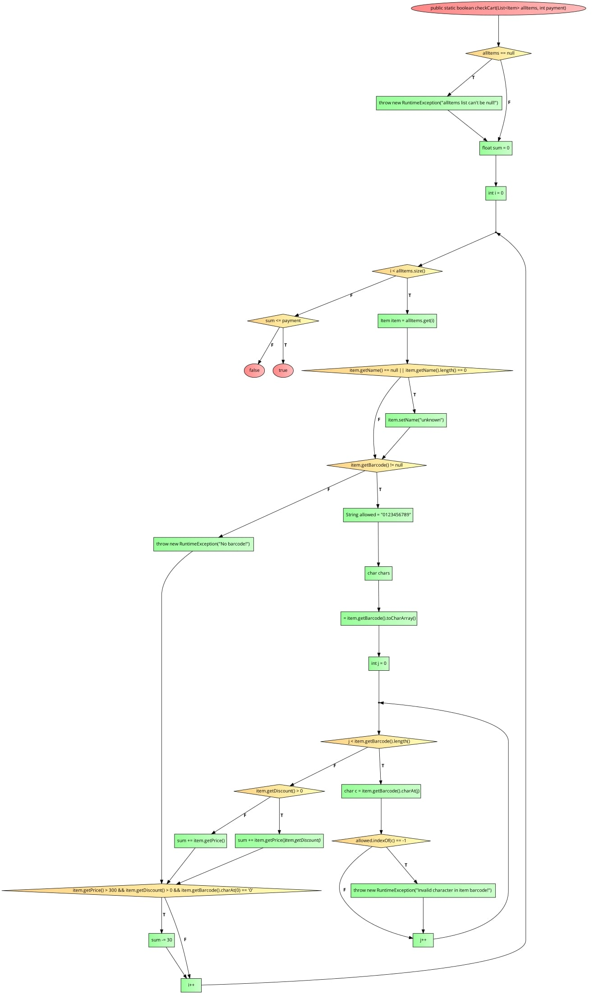

# SI_2024_lab2_171187
## Кристина Неделкова, бр.на индекс 171187

###  Control Flow Graph

### Цикломатска комплексност

Цикломатската комплексност на овој код е 4(23-21+2*1), истата ја добив преку формулата E-N+2P, каде што E е број на ребра (23), N е број на јазли (21), P е поврзана компонента што изнесува 1.

### Тест случаи според критериумот  Every Branch 

Тест случај 1: allItems == null
Input: checkCart(null, 100)
Expected Output: RuntimeException "allItems list can't be null!"
Тест случај 2: item.getName() == null
Input: checkCart([new Item(null, "123456", 100, 0)], 100)
Expected Output: true (name is set to "unknown")
Тест случај 3: item.getName().length() == 0
Input: checkCart([new Item("", "123456", 100, 0)], 100)
Expected Output: true (name is set to "unknown")
Тест случај 4: item.getBarcode() == null
Input: checkCart([new Item("item", null, 100, 0)], 100)
Expected Output: RuntimeException "No barcode!"
Тест случај 5: Invalid character in barcode
Input: checkCart([new Item("item", "1234a6", 100, 0)], 100)
Expected Output: RuntimeException "Invalid character in item barcode!"
Тест случај 6: Valid barcode with discount
Input: checkCart([new Item("item", "123456", 100, 0.1f)], 100)
Expected Output: true (sum = 10, payment = 100)
Тест случај 7: Valid barcode without discount
Input: checkCart([new Item("item", "123456", 100, 0)], 100)
Expected Output: true (sum = 100, payment = 100)
Тест случај 8: Price > 300, discount > 0, barcode starts with '0'
Input: checkCart([new Item("item", "0123456", 350, 0.1f)], 100)
Expected Output: true (sum = 35, -30 for discount condition, total = 5, payment = 100)
Тест случај 9: sum <= payment
Input: checkCart([new Item("item", "123456", 100, 0)], 100)
Expected Output: true (sum = 100, payment = 100)
Тест случај 10: sum > payment
Input: checkCart([new Item("item", "123456", 200, 0)], 100)
Expected Output: false (sum = 200, payment = 100)

Објаснување на тест случаите:

Тест случај 1:
Опис: Тестира дали методот фрла исклучок кога list of items е null.
Input: null, 100
Expected Output: Exception with message "allItems list can't be null!"
Покриена гранка/и: Branch 1

Тест случај 2:
Опис: Тестира дали методот го сетира item name на "unknown" кога name е null.
Input: [new Item(null, "123456", 100, 0)], 100
Expected Output: true
Покриена гранка/и: Branch 2

Тест случај 3:
Опис: Тестира дали методот го сетира item name на "unknown" кога name е празен стринг.
Input: [new Item("", "123456", 100, 0)], 100
Expected Output: true
Покриена гранка/и: Branch 2

Тест случај 4:
Опис: Тестира дали методот фрла исклучок кога item's barcode е null.
Input: [new Item("item", null, 100, 0)], 100
Expected Output: Exception with message "No barcode!"
Покриена гранка/и: Branch 3, Branch 6

Тест случај 5:
Опис: Тестира дали методот фрла исклучок кога barcode содржи невалиден character.
Input: [new Item("item", "1234a6", 100, 0)], 100
Expected Output: Exception with message "Invalid character in item barcode!"
Покриена гранка/и: Branch 3, Branch 4

Тест случај 6:
Опис: Ја тестира пресметката на збирот кога item има валиден barcode и discount.
Input: [new Item("item", "123456", 100, 0.1f)], 100
Expected Output: true
Покриена гранка/и: Branch 3, Branch 5

Тест случај 7:
Опис: Ја тестира пресметката на збирот кога item има валиден barcode без discount.
Input: [new Item("item", "123456", 100, 0)], 100
Expected Output: true
Покриена гранка/и: Branch 3, Branch 5 (else делот)

Тест случај 8:
Опис: Ја тестира пресметката на збирот кога item price е поголема од 300, има discount, и barcode започнува со '0'.
Input: [new Item("item", "0123456", 350, 0.1f)], 100
Expected Output: true
Покриена гранка/и: Branch 3, Branch 5, Branch 7

Тест случај 9:
Опис: Тестира дали методот враќа true кога сумата е помала или еднаква на payment.
Input: [new Item("item", "123456", 100, 0)], 100
Expected Output: true
Покриена гранка/и: Branch 8

Тест случај 10:
Опис: Тестира дали методот враќа false кога сумата е поголема од payment.
Input: [new Item("item", "123456", 200, 0)], 100
Expected Output: false
Покриена гранка/и: Branch 8

### Тест случаи според Multiple Condition критериумот за условот: if (item.getPrice() > 300 && item.getDiscount() > 0 && item.getBarcode().charAt(0) == '0').

Тест случај 1: T, T, T
Item Properties:
price: 350 (поголема од 300)
discount: 10 (поголем од 0)
barcode: "0123456789" (првиот character е '0')
Expected Result: Condition is met, so the special discount logic (sum -= 30) should be applied.
Тест случај 2: T, T, F
Состојба: item.getPrice() > 300 и item.getDiscount() > 0 се true, item.getBarcode().charAt(0) == '0' е false.
Item Properties:
price: 350 (поголема од 300)
discount: 10 (поголем од 0)
barcode: "1123456789" (првиот character не е '0')
Expected Result: Condition is not met, so the special discount logic should not be applied.
Тест случај 3: T, F, T
Состојба: item.getPrice() > 300 и item.getBarcode().charAt(0) == '0' се true, item.getDiscount() > 0 е false.
Item Properties:
price: 350 (поголема од 300)
discount: 0 (не е поголем од 0)
barcode: "0123456789" (првиот character е '0')
Expected Result: Condition is not met, so the special discount logic should not be applied.
Тест случај 4: T, F, F
Состојба: item.getPrice() > 300 е true, item.getDiscount() > 0 и item.getBarcode().charAt(0) == '0' се false.
Item Properties:
price: 350 (поголема од 300)
discount: 0 (не е поголем од 0)
barcode: "1123456789" (првиот character не е '0')
Expected Result: Condition is not met, so the special discount logic should not be applied.
Тест случај 5: F, T, T
Состојба: item.getPrice() > 300 е false, item.getDiscount() > 0 и item.getBarcode().charAt(0) == '0' се true.
Item Properties:
price: 250 (не е поголема од 300)
discount: 10 (поголем од 0)
barcode: "0123456789" (првиот character е '0')
Expected Result: Condition is not met, so the special discount logic should not be applied.
Тест случај 6: F, T, F
Состојба: item.getPrice() > 300 е false, item.getDiscount() > 0 е true, item.getBarcode().charAt(0) == '0' е false.
Item Properties:
price: 250 (не е поголема од 300)
discount: 10 (поголем од 0)
barcode: "1123456789" (првиот character не е '0')
Expected Result: Condition is not met, so the special discount logic should not be applied.
Тест случај 7: F, F, T
Состојба: item.getPrice() > 300 и item.getDiscount() > 0 се false, item.getBarcode().charAt(0) == '0' е true.
Item Properties:
price: 250 (не е поголема од 300)
discount: 0 (не е поголем од 0)
barcode: "0123456789" (првиот character е '0')
Expected Result: Condition is not met, so the special discount logic should not be applied.
Тест случај 8: F, F, F
Item Properties:
price: 250 (не е поголема од 300)
discount: 0 (не е поголем од 0)
barcode: "1123456789" (првиот character не е '0')
Expected Result: Condition is not met, so the special discount logic should not be applied.